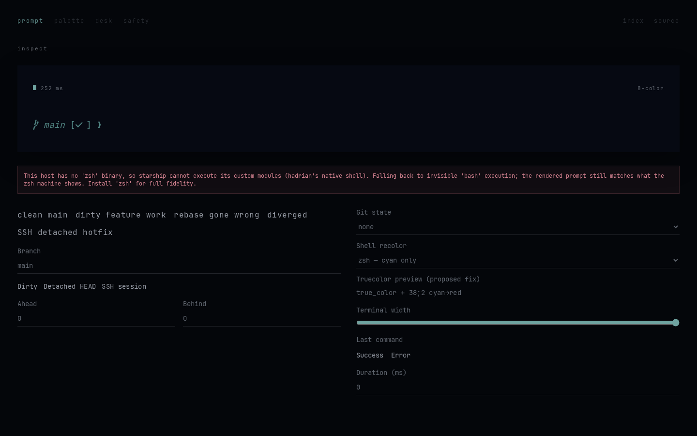
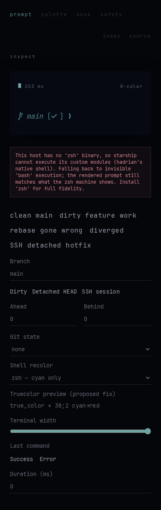
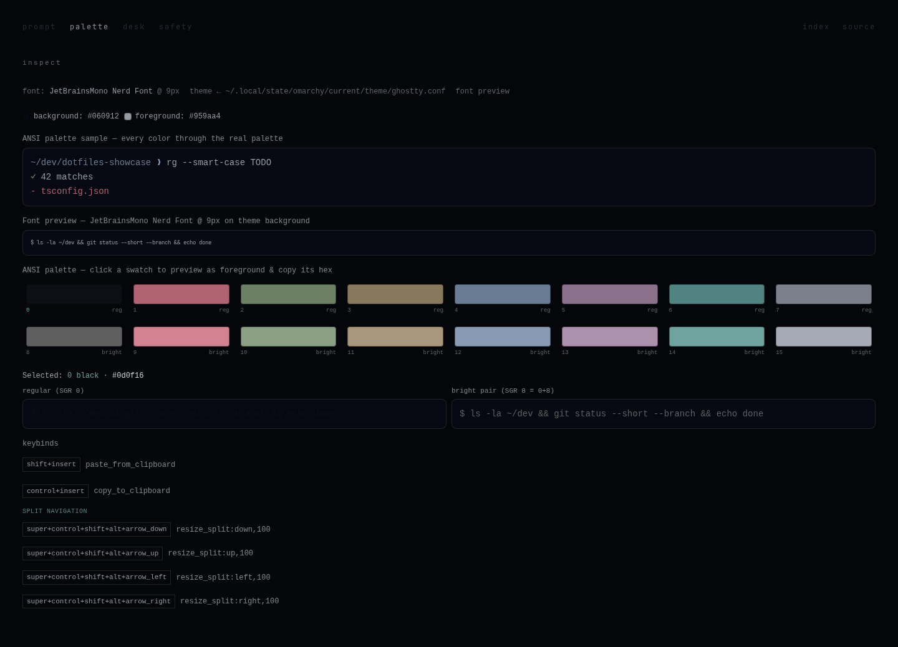
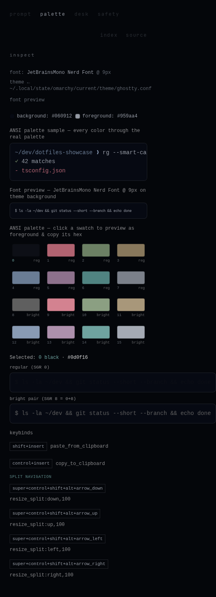
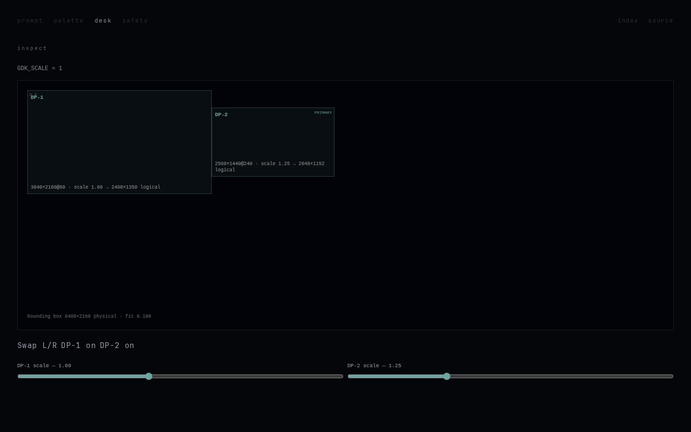
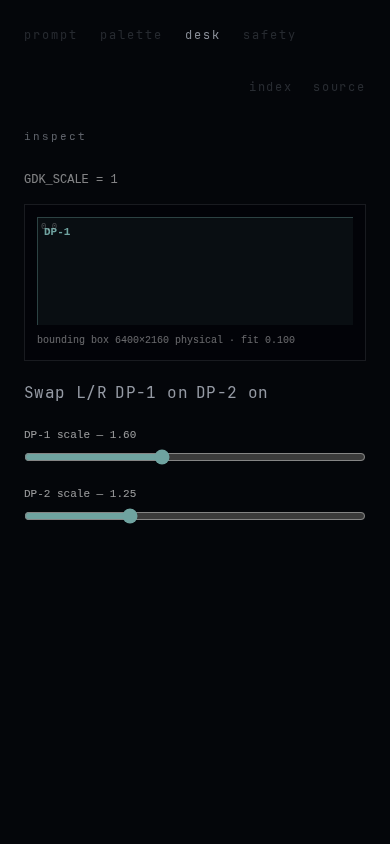
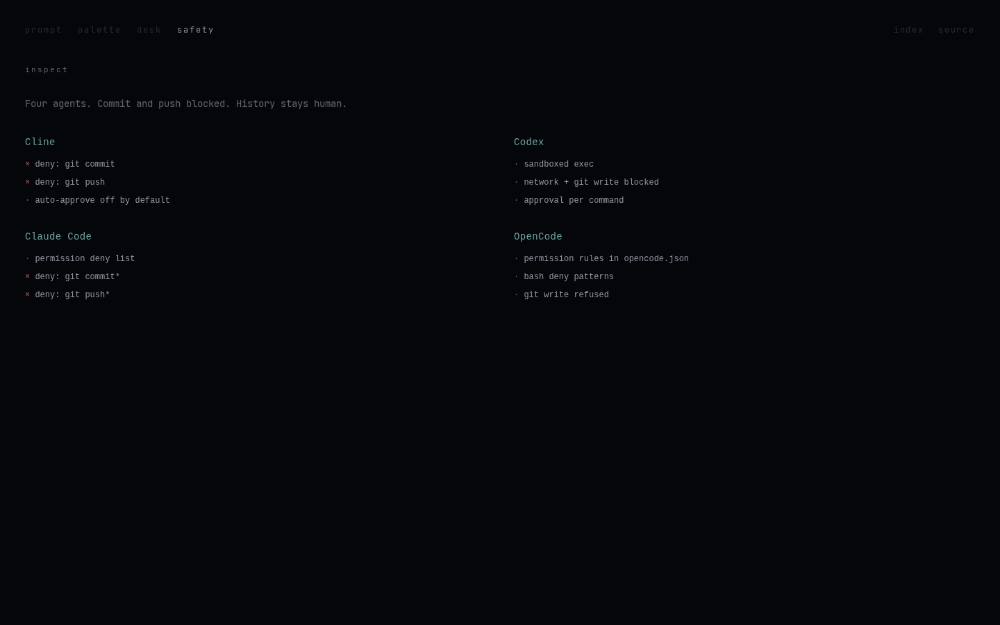
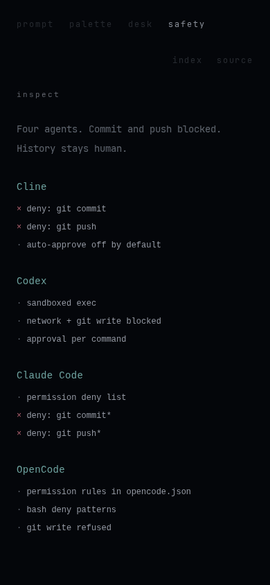
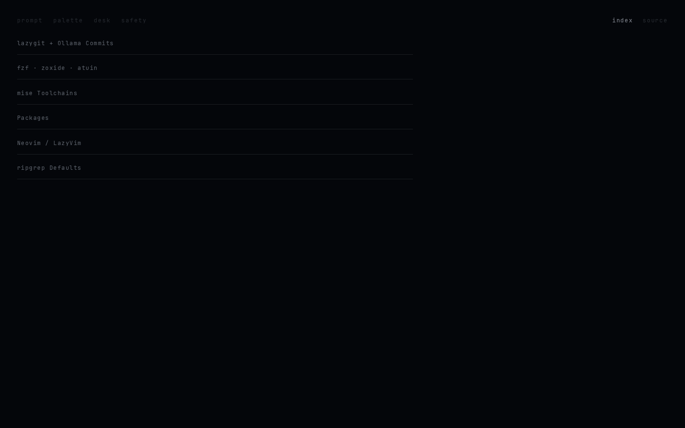

# Sleeping Display — review captures

Desktop 1440×900 and phone 390×844, captured after the visual overhaul.

## Veil

First paint is unlit glass and a block cursor.

## Prompt

First touch wakes into Starship occupying the field.

## Palette

## Desk

## Safety

## Index

Leftover receipts behind the word `index` (desktop).

